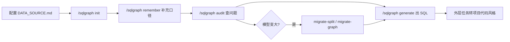

# SQLGraph

**证据驱动的 SQL 语义建模 Cursor Agent Skill — 让 AI 读懂你的业务表结构，生成可审计的基础 SQL。**

[](LICENSE)
[](https://agentskills.io/specification)

SQLGraph 是一个面向 **Cursor / Claude Code / Codex** 等 AI 编程助手的 Agent Skill。它把分散在项目里的表结构、JOIN 关系、业务指标和自然语言术语，沉淀为**可维护、有证据、可审计**的语义模型，并在此基础上生成基础 SQL 草稿，再由外层任务转换为 `LambdaQueryWrapper`、MyBatis XML、注解查询等项目代码风格。

---

## 为什么需要 SQLGraph？

在 ERP、数据中台、报表系统里，业务 SQL 往往散落在：

- MyBatis XML / Mapper 注解
- Service 层的 `LambdaQueryWrapper`
- 口口相传的「这个字段代表已过账」

AI 直接猜表关系容易出错，也难以解释依据。SQLGraph 的做法是：

| 问题 | SQLGraph 的解法 |
|------|----------------|
| 表和字段含义不清 | `entities` 记录表映射、主键、软删除、枚举 |
| JOIN 路径靠猜 | `relationships` 记录已命名、可复用的关联路径 |
| 「销售额」「已过账」口径不一 | `metrics` + 有作用域的 `business_terms` |
| AI 编造表关系 | `evidence` 要求每条事实有来源，无证据只能标为 draft |
| 模型变大难维护 | 三级存储：单文件 YAML → 拆分 YAML → 可选 SQLite 关系图 |

---

## 核心能力

- **语义建模**：实体、关系、指标、业务术语、证据五类事实分离，职责清晰。
- **证据驱动**：没有证据不能当 confirmed；冲突必须先确认再改。
- **命令式工作流**：`/sqlgraph init`、`update`、`remember`、`generate`、`audit`、`migrate-*`。
- **渐进式扩展**：小项目用单文件 YAML；变大后拆分；关系密集时可选 SQLite 图索引。
- **安全默认**：删除语义一律逻辑删除 `UPDATE ... SET deleted = 1`，不生成物理 `DELETE`。
- **只读外库**：遵循 `DATA_SOURCE.md` 契约，外部数据库访问保持只读。

---

## 快速开始

### 1. 安装 Skill

**项目级（推荐，随仓库共享）：**

```bash
git clone https://github.com/ccup26/sqlgraph.git .cursor/skills/sqlgraph
```

**个人级（所有项目可用）：**

```bash
git clone https://github.com/ccup26/sqlgraph.git ~/.cursor/skills/sqlgraph
```

也可手动将本仓库复制到 `.cursor/skills/sqlgraph/` 或 `~/.cursor/skills/sqlgraph/`。

### 2. 声明数据源

编辑 `semantic_model/DATA_SOURCE.md`，写明项目可用的数据来源，例如：

- DDL / schema 文档路径
- 常用 SQL 示例
- 表关系说明
- 代码中 Mapper、XML、Service 的位置

这是 Skill 读取项目的**接口契约**，不绑定固定格式。

### 3. 初始化语义模型

在 Cursor 中对 Agent 说：

```text
/sqlgraph init
```

Skill 会从 `DATA_SOURCE.md` 声明的来源抽取草稿，无证据的推断会标记为 `draft`。

### 4. 沉淀业务知识

```text
/sqlgraph remember
发货单的「已过账」指 dn_status = 'POSTED'，且要过滤 deleted = 0
```

### 5. 生成 SQL

```text
/sqlgraph generate
查询本月已过账发货单数量，按客户分组
```

输出的是**基础 SQL 草稿**及所用模型事实；项目风格转换由外层任务完成。

---

## 命令一览

| 命令 | 作用 |
|------|------|
| `/sqlgraph init` | 从代码与数据源初始化语义模型草稿 |
| `/sqlgraph update` | 按数据源刷新模型，先出 diff，不静默覆盖 |
| `/sqlgraph remember` | 将自然语言或 SQL 沉淀为语义事实 |
| `/sqlgraph generate` | 按意图匹配指标/术语，生成基础 SQL |
| `/sqlgraph audit` | 检查无证据、冲突、重复语义、索引过期等问题 |
| `/sqlgraph migrate-split` | 经确认后，将大模型从单文件迁移为拆分 YAML |
| `/sqlgraph migrate-graph` | 经确认后，为关系密集模型准备 SQLite 语义图索引 |

完整规范见 [SKILL.md](./SKILL.md)。

---

## 语义模型结构

```text
entities        业务对象：表映射、主键、软删除、枚举、字段级外键
relationships   已命名、可复用的实体关联 / 业务路径
metrics         业务指标：参数、度量、过滤、路径、示例
business_terms  有作用域的自然语言别名（如「已过账」在发货单语境下）
evidence        每条事实的来源与置信度
```

### 三级存储

```text
Level 1（默认）  semantic-model.yaml           小模型，单文件 YAML
Level 2          index.yaml + entities/...     大模型拆分 + 路由索引
Level 3（可选）  semantic_graph.sqlite         关系密集时的路径检索索引
```

升级阈值参考：单文件 >800–1200 行、指标 >30、关系 >50 时考虑 Level 2；关系 >150 或多跳路径频繁时考虑 Level 3。

---

## 目录结构

```text
sqlgraph/
├── SKILL.md                      # Agent Skill 完整规范（AI 读取）
├── README.md                     # 人类可读说明（本文件）
├── LICENSE
└── semantic_model/
    ├── DATA_SOURCE.md            # 数据源契约（使用前必配）
    ├── evidence.yaml             # 证据注册表
    ├── semantic-model.yaml       # Level 1 单文件模型
    ├── index.yaml                # Level 2 路由索引（可选）
    ├── entities/                 # Level 2 实体（可选）
    ├── relationships.yaml        # Level 2 关系（可选）
    ├── metrics/                  # Level 2 指标（可选）
    ├── terms/                    # Level 2 术语（可选）
    └── semantic_graph.sqlite     # Level 3 关系图（可选）
```

---

## 典型工作流



1. 在 `DATA_SOURCE.md` 声明真实数据源
2. `/sqlgraph init` 从代码和文档抽取草稿
3. `/sqlgraph remember` 补充业务口径
4. `/sqlgraph audit` 发现冲突与缺失证据
5. `/sqlgraph generate` 生成可解释的基础 SQL
6. 模型变大后再考虑拆分或建图索引

---

## 适用场景

- ERP / 供应链 / 财务等业务系统的 SQL 开发与重构
- 让 AI 理解复杂表关系后再写查询，而不是凭空猜测
- 团队共享一套可版本化的业务语义层
- 从旧版 `sql-semantic-modeling` 升级到 `sqlgraph`（支持 `/sqlgraph` 命令前缀与分级存储）

## 不适用场景

- 替代数据库建模工具或 BI 平台
- 直接修改业务项目代码（本 Skill 只产出基础 SQL 草稿）
- 无证据的自动「全库推断」（会标为 draft 或要求确认）

---

## 设计原则

1. **关系纯净**：`relationships` 只存关联路径，不混指标过滤和度量
2. **实体最小**：`entities` 只存稳定结构事实，普通查询字段进 `metrics`
3. **术语有作用域**：「已过账」「金额」必须绑定实体或指标语境
4. **证据优先**：无证据 = draft，不能当 confirmed
5. **用户确认**：冲突更新、模型迁移需经明确同意
6. **逻辑删除**：删除语义不生成物理 `DELETE`

---

## 与 AI 工具集成

本仓库符合 [Agent Skills 规范](https://agentskills.io/specification)。安装后，Agent 会根据 `SKILL.md` 中的 `description` 自动判断是否启用：

- 初始化或更新 SQL 语义模型
- 将自然语言 / SQL 记为指标、关系、实体或术语
- 审计模型冲突
- 生成 SQL 或 SQL 相关逻辑

无需手动「开关」——描述你的任务即可，例如：「根据语义模型查本月发货单明细」。

---

## 许可证

[MIT License](./LICENSE)

---

## 反馈与贡献

欢迎通过 [Issues](https://github.com/ccup26/sqlgraph/issues) 反馈使用问题或提交改进建议。

如果 SQLGraph 对你的项目有帮助，欢迎 Star 支持。
